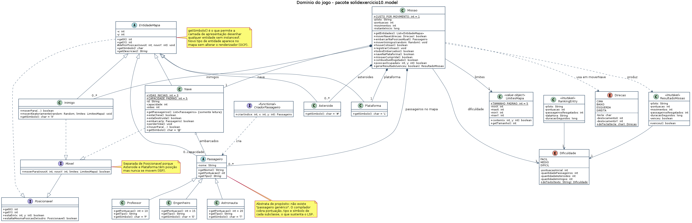
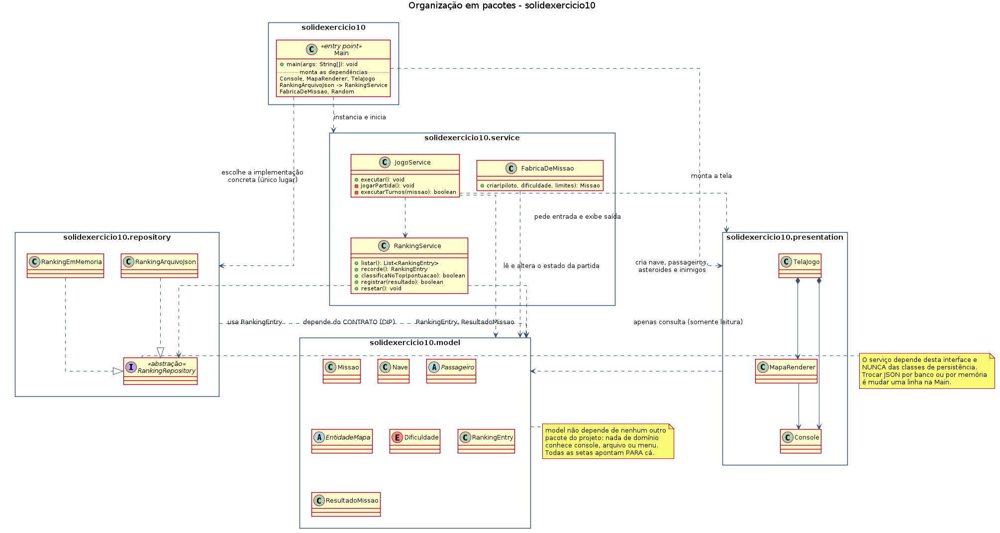

# Missão Marte Unifor

Jogo de console em Java: o piloto controla uma nave em um mapa cartesiano, resgata passageiros, desvia de asteroides e inimigos e precisa pousar de volta na plataforma em (0,0) para cumprir a missão. As cinco melhores pontuações ficam gravadas em `ranking.json`.

Este repositório tem **duas versões do mesmo jogo**, propositalmente:

| Pasta | O que é |
|---|---|
| `src/missao` | Versão original, entregue na primeira atividade (exercícios 1 a 10). Preservada sem alterações, para comparação. |
| `src/solidexercicio10` | Versão refatorada com os princípios SOLID, entregue nesta atividade. Mesmo jogo, mesmo comportamento, organizado em camadas. |

---

## Equipe

| Integrante | Matrícula | Usuário no Git |
|---|---|---|
| Levi Costa Queiroz | 2510500 | levicostaq |
| Pedro Nicolas | 2513847 | PedroNicolas19 |
| Leonardo Norões | 2517418 | leomilfont |

**Disciplina:** Projeto e Arquitetura de Sistemas — Ciência da Computação, UNIFOR

---

## Como compilar

Requisito: JDK 17 ou superior (desenvolvido e testado no JDK 21).

Os comandos abaixo devem ser executados na **raiz do repositório**.

### Versão refatorada (SOLID)

**Windows (PowerShell)**

```powershell
javac -encoding UTF-8 -d out (Get-ChildItem -Recurse -Filter *.java src/solidexercicio10 | ForEach-Object FullName)
```

**Linux / macOS**

```bash
javac -encoding UTF-8 -d out $(find src/solidexercicio10 -name "*.java")
```

### Versão original, para comparação

**Windows (PowerShell)**

```powershell
javac -encoding UTF-8 -d out-original (Get-ChildItem -Recurse -Filter *.java src/missao | ForEach-Object FullName)
```

**Linux / macOS**

```bash
javac -encoding UTF-8 -d out-original $(find src/missao -name "*.java")
```

## Como executar

```bash
# versão refatorada
java -cp out solidexercicio10.Main

# versão original
java -cp out-original missao.Main
```

No Windows, se os acentos saírem trocados no terminal, rode com:

```powershell
java -Dstdout.encoding=UTF-8 -cp out solidexercicio10.Main
```

## Como jogar

| Tecla | Ação |
|---|---|
| `w` `a` `s` `d` | mover a nave (cada movimento custa 1 ponto de combustível) |
| `c` | embarcar o passageiro que estiver na casa da nave |
| `q` | abortar a missão |

No menu inicial: `1` nova missão, `2` ranking Top 5, `3` resetar o ranking, `4` sair.

Legenda do mapa: `@` nave, `P` professor (+10), `E` engenheiro (+15), `T` astronauta (+20), `#` asteroide, `X` inimigo, `L` plataforma de pouso, `.` espaço livre.

**Para vencer:** resgatar todos os passageiros **e** voltar à plataforma `L` em (0,0). Só resgatar não encerra a missão. Colidir com asteroide ou inimigo custa uma das 3 vidas; ficar sem combustível encerra a partida.

## Testes

```bash
# Linux / macOS
javac -encoding UTF-8 -d out $(find src/solidexercicio10 tests -name "*.java")
java -cp out solidexercicio10.tests.TesteRefatoracao
```

```powershell
# Windows (PowerShell)
javac -encoding UTF-8 -d out (Get-ChildItem -Recurse -Filter *.java src/solidexercicio10,tests | ForEach-Object FullName)
java -cp out solidexercicio10.tests.TesteRefatoracao
```

São 72 verificações sem biblioteca externa, sem teclado e sem depender de arquivo em disco. Última execução: **72 verificações, 0 falhas**.

As evidências dos testes manuais e automatizados estão em `docs/evidencias/`:

- `testes-automatizados.txt` — saída completa da bateria de testes
- `partida-vitoria.txt` — uma partida inteira até a vitória, com estatísticas e gravação no ranking
- `menu-e-ranking.txt` — ranking vazio, ranking com dados, opção inválida, reset cancelado e reset confirmado

---

## Quais alterações foram realizadas

A versão original funcionava, mas concentrava quase tudo na `Main`: 383 linhas com menu, laço de jogo, sorteio de entidades, desenho do mapa, leitura do teclado, estatísticas e formatação do ranking. A refatoração distribuiu isso em camadas, sem mudar o que o jogador vê.

| Pacote | Responsabilidade |
|---|---|
| `solidexercicio10` | `Main`: monta as dependências e inicia o jogo. 47 linhas. |
| `solidexercicio10.model` | Entidades e regras do domínio: `EntidadeMapa`, `Passageiro` e subclasses, `Nave`, `Inimigo`, `Asteroide`, `Plataforma`, `Missao`, `LimitesMapa`, `Direcao`, `Dificuldade`, `ResultadoMissao`, `RankingEntry`, interfaces `Posicionavel` e `Movel`. |
| `solidexercicio10.service` | `JogoService` (fluxo do menu e da partida), `FabricaDeMissao` (montagem do mapa), `RankingService` (regras do Top 5). |
| `solidexercicio10.presentation` | `Console` (I/O de texto), `MapaRenderer` (desenho do mapa), `TelaJogo` (menus, perguntas, mensagens e relatórios). |
| `solidexercicio10.repository` | `RankingRepository` (contrato), `RankingArquivoJson` (persistência em JSON), `RankingEmMemoria` (implementação volátil). |

Mudanças principais em relação à versão original:

1. **`Main` esvaziada.** Saiu de 383 para 47 linhas; virou apenas montagem de dependências.
2. **Regras da partida na `Missao`.** Pontuação, contagem de movimentos, colisão e condição de vitória saíram das variáveis locais do laço de console.
3. **Renderizador sem `instanceof`.** Cada entidade informa o próprio símbolo (`getSimbolo()`); o `MapaRenderer` percorre `missao.getEntidades()` e não conhece nenhum tipo concreto. A legenda é montada a partir das entidades presentes no mapa.
4. **`Passageiro` virou abstrata.** Na versão original era concreta e devolvia 10 pontos por padrão, o que escondia um `@Override` esquecido. Agora o compilador cobra pontuação, tipo e símbolo de cada subclasse.
5. **Persistência atrás de uma interface.** `RankingService` depende de `RankingRepository`; trocar JSON por memória (ou por um banco) é uma linha na `Main`.
6. **Regra separada de armazenamento.** Ordenação, Top 5 e critério de classificação ficaram no serviço; leitura e escrita de arquivo, no repositório.
7. **Console isolado.** Nenhuma classe de `model` ou `service` chama `System.out` ou cria `Scanner`.
8. **Novos tipos de domínio no lugar de código repetido.** `LimitesMapa` substituiu os quatro parâmetros `minX/maxX/minY/maxY` que circulavam por todo método; `Direcao` tirou o `switch` de teclado de dentro da `Nave`; `Plataforma` eliminou o caso especial `if (x == 0 && y == 0)` do desenho do mapa.
9. **Encapsulamento da nave.** `getPassageiros()` devolve lista somente-leitura, impedindo embarque por fora da checagem de capacidade.
10. **Testes automatizados.** 72 verificações das regras, impossíveis na versão original porque tudo dependia do `Scanner`.

## Quais decisões de projeto foram tomadas

- **Símbolo do mapa dentro do domínio.** Escolha deliberada: colocar `getSimbolo()` em `EntidadeMapa` mistura um detalhe de apresentação com o domínio, mas é o que permite ao renderizador ficar fechado a mudanças. Trocamos pureza de camada por OCP no ponto que mais mexemos durante os exercícios. Discutido em `REVISAO-SOLID.md`, item 2.1.
- **`RankingService` em `service`, não em `repository`.** Divergência consciente do tutorial: mudar Top 5 para Top 10 é decisão de jogo, mudar JSON para CSV é decisão de infraestrutura. São dois motivos diferentes de mudança, então estão em duas classes. Item 4.2 da revisão.
- **`RankingEntry` em `model`.** É dado de domínio: existiria igual com qualquer forma de persistência. Assim `repository` depende de `model`, nunca o contrário.
- **Três classes na apresentação em vez de uma.** `Console`, `MapaRenderer` e `TelaJogo`. O custo assumido é que `TelaJogo` faz entrada e saída. Item 4.3 da revisão.
- **`Random` injetado.** `FabricaDeMissao` e `JogoService` recebem o `Random` da `Main`, o que permite fixar a semente e reproduzir uma partida em teste.
- **Interfaces pequenas.** `Posicionavel` (2 métodos) separada de `Movel` (1 método), porque asteroide e plataforma têm posição mas não se movem. Não criamos `LeitorDeRanking`/`EscritorDeRanking` porque não existe cliente que só leia.

## Quais limitações permanecem

1. `RankingArquivoJson` imprime mensagens de erro de I/O direto no console — a camada mais baixa conhecendo a apresentação. É a primeira coisa a corrigir (prioridade alta na revisão).
2. A duração da partida usa `System.currentTimeMillis()` dentro da `Missao`, o que a torna intestável sem esperar tempo real.
3. Não há teste de contrato garantindo que toda subclasse futura de `Passageiro` conceda pontuação positiva.
4. Em mapa muito pequeno com dificuldade Difícil (11 entidades para 8 casas livres), a fábrica desiste após 500 tentativas e a partida começa com menos obstáculos, sem avisar. A versão original entrava em laço infinito nessa situação.
5. `ranking.json` corrompido por edição manual não gera aviso: o parser ignora o que não entende.
6. O parser de JSON é manual e só entende o formato que o próprio jogo grava.

A análise completa, com prioridade de cada item, está em [`REVISAO-SOLID.md`](REVISAO-SOLID.md).

---

## Diagramas UML

Os arquivos-fonte (`.puml`) e as imagens (`.png`) estão em [`docs/uml/`](docs/uml/).

### Diagrama de classes do domínio



Fonte: [`docs/uml/diagrama-classes-model.puml`](docs/uml/diagrama-classes-model.puml)

Mostra o pacote `solidexercicio10.model`: as interfaces `Posicionavel` e `Movel`, a classe abstrata `EntidadeMapa` com suas cinco subclasses, a hierarquia de `Passageiro` com as três pontuações, os enums `Dificuldade` e `Direcao` e os objetos de valor `LimitesMapa`, `ResultadoMissao` e `RankingEntry`.

O que o diagrama deixa ver:

- **Composição (losango cheio)** entre `Missao` e as entidades do mapa: a missão é dona da nave, da plataforma e das listas de passageiros (`0..*`), asteroides (`0..*`) e inimigos (`0..*`). Descartada a missão, nada disso sobrevive.
- **Agregação (losango vazio)** entre `Nave` e `Passageiro` com multiplicidade `0..capacidade`: o passageiro embarcado existia antes de entrar na nave e continua sendo a mesma pessoa.
- **`Movel` herdando de `Posicionavel`**, implementada só por `Nave` e `Inimigo`. `Asteroide` e `Plataforma` ficam de fora: têm posição, não têm movimento (ISP).
- **`getSimbolo()` abstrato em `EntidadeMapa`**, que é a razão de o renderizador não precisar de `instanceof`.

### Diagrama de pacotes



Fonte: [`docs/uml/diagrama-pacotes.puml`](docs/uml/diagrama-pacotes.puml)

Mostra os cinco pacotes e a direção das dependências. Os dois pontos que ele foi feito para evidenciar:

- **`RankingService` aponta para a interface `RankingRepository`, não para `RankingArquivoJson`.** As implementações concretas apontam para a mesma interface, de baixo para cima. Só a `Main` toca nas classes concretas (DIP).
- **Todas as setas convergem para `model`, que não aponta para ninguém.** Nada de domínio conhece console, arquivo ou menu.

---

## Estrutura do repositório

```
.
├── src/
│   ├── missao/                  versão original preservada (atividade 1)
│   └── solidexercicio10/        versão refatorada com SOLID
│       ├── Main.java
│       ├── model/
│       ├── service/
│       ├── presentation/
│       └── repository/
├── tests/
│   └── solidexercicio10/tests/  testes automatizados, sem biblioteca externa
├── docs/
│   ├── uml/                     diagramas (.puml e .png)
│   └── evidencias/              saídas dos testes manuais e automatizados
├── ranking.json                 gerado na primeira partida vencida
├── REVISAO-SOLID.md             revisão crítica da refatoração
└── README.md
```
